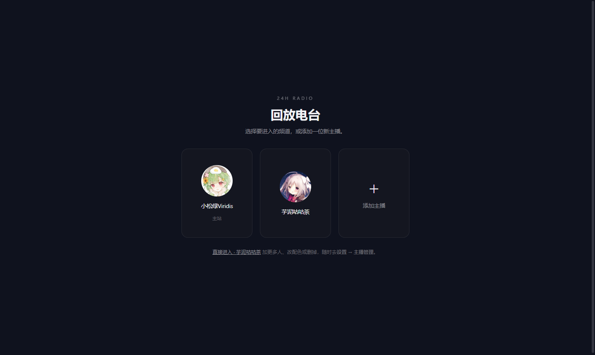
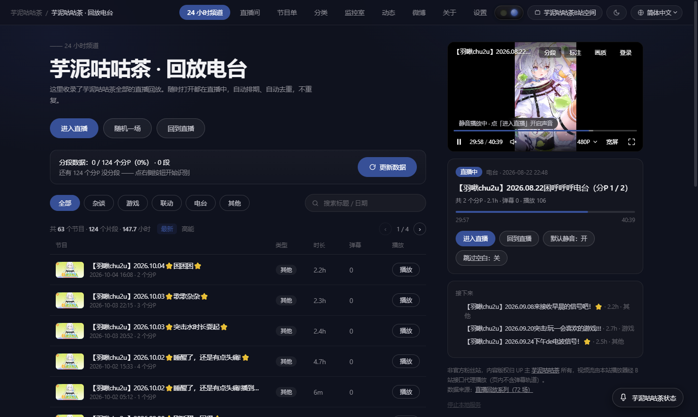
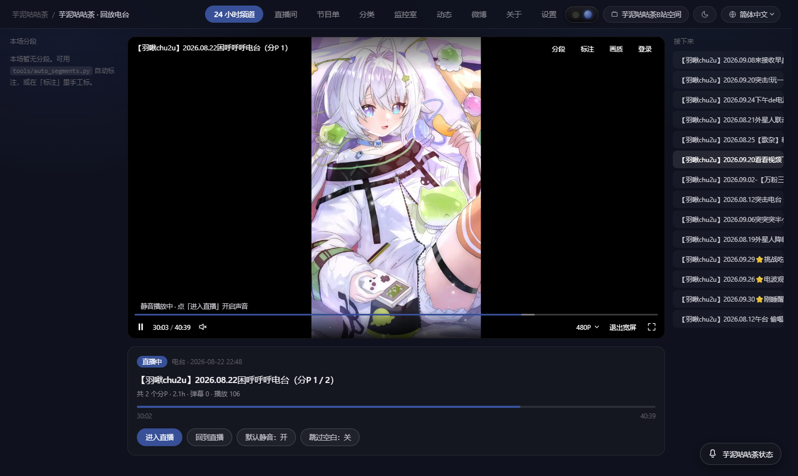
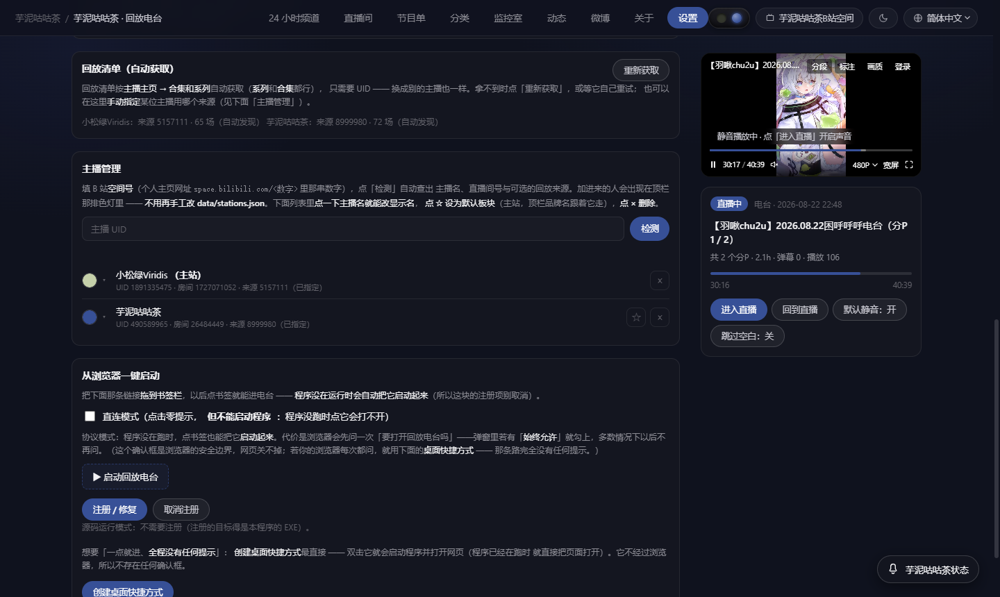
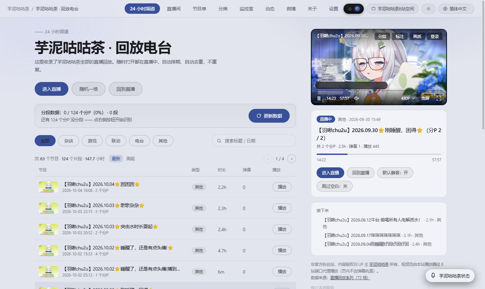

# 回放电台

不预设主播的 24 小时直播回放频道：填一位 B 站主播的 UID，把 TA 的直播回放变成一个「随时打开都在直播中」的频道。全部运行在本机，不需要服务器。



---

## 怎么用（Windows）

1. 从 [Releases](https://github.com/DcC176/replay-radio/releases) 下载最新的 `ReplayRadio-vX.Y.Z.exe`，双击运行。
2. 浏览器自动打开，首屏让你填一位主播的 **B 站 UID**（个人主页网址里那串数字）。
3. 点「检测」→ 确认名字与回放来源 →「就听 TA 的」即进入频道。
4. 之后再看，直接访问 `http://127.0.0.1:8765/`；要停止时在页面右下角点「停止本地服务」。

- 端口 8765 被占用时会自动顺延到 8766、8767……
- 网页文件与本机数据都在 `%LOCALAPPDATA%\ReplayRadio\`
- 换主播、改颜色、改显示名都在 **设置 → 主播管理**



---

## 能做什么

| 功能 | 说明 |
|---|---|
| 24 小时频道 | 全部回放按固定顺序排成一条循环时间轴，打开即对齐到「现在该播第几场」 |
| 跳过空白 | 按音频与画面自动标出「有内容」的片段，只播这些片段（可关） |
| 分段导航 | 播放器「分段」面板列出本场片段，点一下直达 |
| 剧场模式 | 网页全屏，左右竖条分别是本场分段与接下来播什么 |
| 多位主播 | 可以添加多位，任一位都能设为默认板块，也能删掉 |
| 板块颜色 | 按头像色块占比给出最多 8 个候选色，点一下即换 |
| 显示名 | 不必用 B 站昵称，页面上可改成你习惯的叫法 |
| 主题 | 深色（黑红）／ 浅色，顶栏一键切换；另有简体／繁体切换 |
| 画质 | 页内扫码登录后可取到 1080P；未登录时接口只下发较低清晰度 |







---

## 从源码运行

需要 Python 3.9 以上（只用标准库）与可联网的环境：

```bash
git clone https://github.com/DcC176/replay-radio.git
cd replay-radio
python tools/serve.py          # 然后打开 http://127.0.0.1:8765/
```

> 必须用它自带的 `tools/serve.py` 启动，既不能 `python -m http.server`，也不要直接双击
> `index.html`：B 站的接口校验 Referer、媒体流也不允许跨域直连，需要这个本机进程代取接口、代转媒体流。
> 回放清单与主播开播状态同样由它现场抓取。

「跳过空白」需要的分段数据由 `tools/auto_segments.py` 生成，依赖 `ffmpeg`，做歌曲边界精修时另需
`numpy` 与 `pillow`；缺依赖时会自动退回纯音频流程，不影响播放本身。

---

## 常见问题

| 现象 | 原因与处理 |
|---|---|
| 提示「本机服务没有连上」 | 服务没运行，或打开的是静态预览。用 `启动.bat` 或 `python tools/serve.py` 启动 |
| 端口 8765 已被占用 | 多半已有一个实例在跑，直接开 `http://127.0.0.1:8765/` 即可；要换端口加 `--port 9000` |
| 打开页面没有自动播放 | 浏览器会拦截带声音的自动播放。默认静音起播，关闭默认静音后需点一下「进入直播」 |
| 暂停后进度与「直播中」对不上 | 频道时钟独立于播放器运行，点「回到直播」复位 |
| 没有 1080P | 未登录时接口只下发到较低清晰度，页内扫码登录后自动可用（能否取到还取决于账号本身） |
| 改了 `tools/serve.py` 后新接口 404 | 服务进程不热加载代码，必须重启 |

---

## 数据与隐私

- 主播列表、分段结果、歌单登记等全部存在本机 `%LOCALAPPDATA%\ReplayRadio\`（源码运行时在项目 `data/` 下），不上传任何地方。
- B 站登录凭据只写入本机 `tools/sessdata.txt`，仅用于向 B 站官方接口取流，不写进页面、不发给任何第三方；点「退出登录」即清除。该文件已被 `.gitignore` 排除。
- 不收集使用数据，无广告、无收费。

## 合规

- 这是**非官方的粉丝向工具**，内容版权归你所添加的主播（UP 主）所有，页面上的署名随当前板块动态显示。
- 播放全程在 B 站体系内完成，本工具不转存、不二次上传；每个节目都提供指向 B 站原视频的链接。
- 随包与页面用到的第三方组件及其许可，见 [CHANGELOG 的「第三方组件」小节](CHANGELOG.md#第三方组件)。

## 开发

- 版本记录与逐版说明：[CHANGELOG.md](CHANGELOG.md)
- 发布前自检：`python tools/verify_release.py`（含首屏启动链冒烟 `tools/tests/smoke_first_screen.js`）
- 本项目是「二十四时小路电台」（[DcC176/komichi-radio](https://github.com/DcC176/komichi-radio)）的平行版本：
  去掉了内置主播与品牌元素，第一位主播由使用者自己添加。
